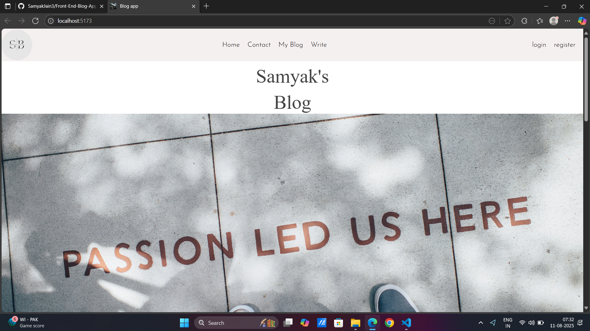
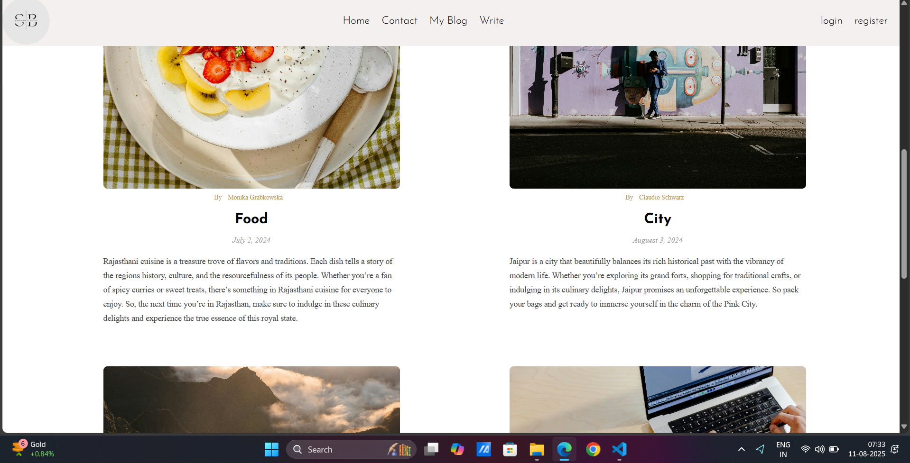
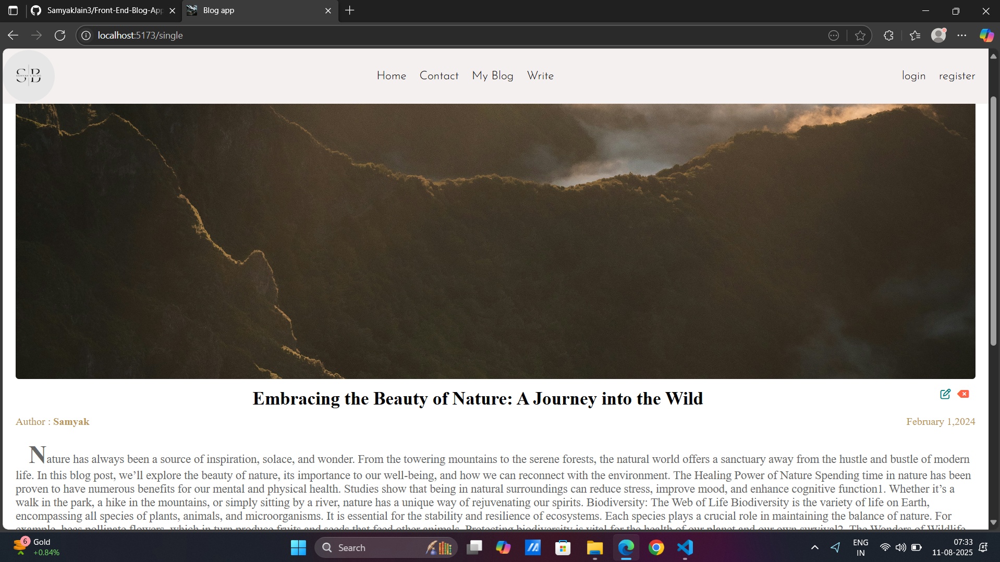
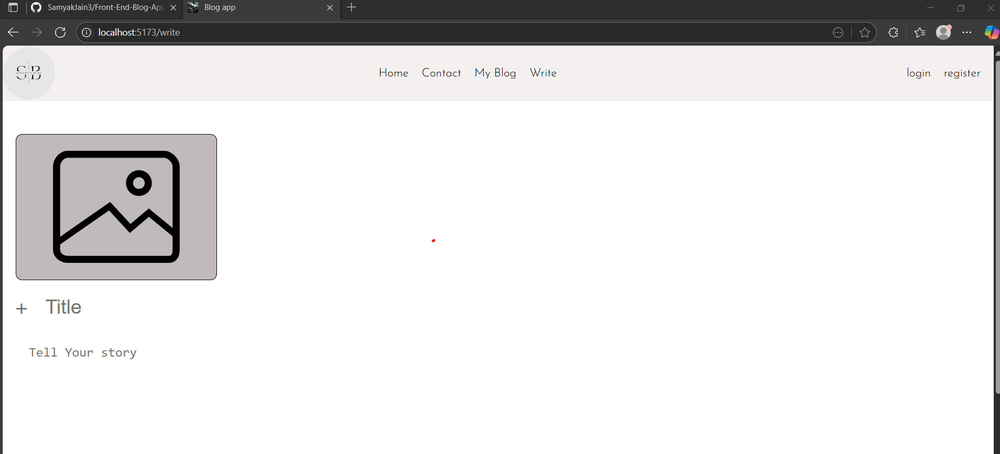

# Front-End Blog App

A responsive blog application built with React and Vite.

## Features

- View blog posts with images, titles, descriptions, and authors
- User authentication: Login and Register pages
- Write and publish new blog posts
- Update user settings
- Sidebar with categories and social links
- Responsive design using CSS and Google Fonts

## Getting Started

Install dependencies:

```sh
npm install
```

Run the development server:

```sh
npm run dev
```

Build for production:

```sh
npm run build
```

## Project Structure

- `src/components/` – Reusable UI components (Header, Sidebar, Post, etc.)
- `src/pages/` – Application pages (Home, Single, Write, Setting, Login, Register)
- `src/assets/img/` – Images used in posts and UI
- `src/App.jsx` – Main app component and routing
- `index.html` – Entry HTML file

## Screenshot







## License

MIT